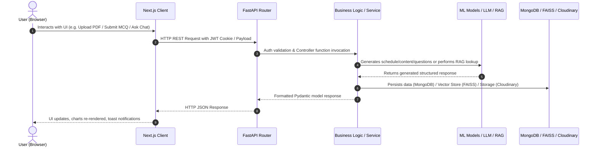

# 🔄 FLOW.md — Code Execution & System Data Flow Map

This document maps out **how execution travels** between files, functions, and modules across **SmartPrep-AI**. It documents exact call sequences, component dependencies, data transformations, and active modifications.

---

## 🗺️ High-Level Request Lifecycle Overview



---

## 🔍 Detailed Feature Execution Pathways

### 1. Authentication Flow

```
[Client] client/components/Auth/LoginModal.jsx
   │
   ├─► Calls [API Layer] client/api/auth.js (`loginUser(credentials)`)
   │      │
   │      └─► HTTP POST /api/auth/login
   │             │
   │             ▼
[Server] server/routes/auth.py (`login_user()`)
   │
   ├─► [Schema Validation] server/schemas/user.py (`UserLogin`)
   ├─► [Service Layer] server/services/auth/auth_service.py (`verify_user_credentials()`)
   │      │
   │      ├─► Queries MongoDB `users` collection via `server/db/config.py`
   │      └─► Validates password hash via `passlib.context.CryptContext` (Argon2)
   │
   └─► Sets HTTP-Only Cookie with JWT token created via `jwt.encode()`
          │
          └─► Returns JSON response with user details to Next.js Client
```

---

### 2. PDF Upload & Day-Wise Schedule Generation Flow

```
[Client] client/pages/dashboard/upload.jsx
   │
   ├─► Sends FormData (PDF File + requested study duration)
   │      │
   │      └─► HTTP POST /api/study/upload-and-schedule
   │             │
   │             ▼
[Server] server/routes/pdf.py (`upload_pdf_and_schedule()`)
   │
   ├─► [Hash & Duplicate Check] Computes MD5 Hash of file
   │      └─► Check MongoDB `pdfs` collection. If exists, returns cached schedule.
   │
   ├─► [PDF Text & OCR Extraction] server/services/pdf_upload/pdf_processor.py
   │      │
   │      ├─► Tries PyMuPDF (`fitz`) text extraction
   │      └─► If text density < threshold → Invokes `server/services/pdf_upload_ocr/ocr_service.py`
   │             ├─► Converts pages to images (`pdf2image`)
   │             ├─► Runs Tesseract OCR on images
   │             └─► Reconstructs PDF via ReportLab
   │
   ├─► [File Storage] Uploads PDF to Cloudinary (`server/db/cloudinary.py`)
   │
   ├─► [TOC Extraction & Schedule Generation] server/services/pdf_upload/schedule_generator.py
   │      │
   │      ├─► Extracts Table of Contents (TOC) or headings
   │      └─► Sends prompt to LLM (`server/core/llm.py` -> Google Gemini / Groq)
   │             └─► Prompt template: `server/prompts/pdf_upload/schedule_prompt.py`
   │
   ├─► [Vector Indexing for RAG] server/services/rag/ingestion.py
   │      ├─► Chunks PDF text using `RecursiveCharacterTextSplitter`
   │      ├─► Computes embeddings using `sentence-transformers/all-MiniLM-L6-v2`
   │      └─► Saves index file in `server/vector_store/<pdf_hash>.faiss`
   │
   └─► [Persistence] Saves metadata to MongoDB (`pdfs` and `schedules` collections)
          └─► Returns complete day-wise study schedule JSON to Client
```

---

### 3. Adaptive Content Generation & Caching Flow

```
[Client] client/pages/study/[pdf_hash]/day/[day_num].jsx
   │
   ├─► Requests content for specific day and topic
   │      │
   │      └─► HTTP POST /api/content/generate
   │             │
   │             ▼
[Server] server/routes/content.py (`generate_content()`)
   │
   ├─► [Cache Check] Searches MongoDB `content_cache` collection for `(book_id, day_number, topic)`
   │      │
   │      ├─► Found in cache → Returns cached Markdown content directly (0ms LLM latency)
   │      │
   │      └─► Not found in cache:
   │             │
   │             ├─► Reads relevant text range from PDF (`server/services/content/content_service.py`)
   │             ├─► Constructs LLM prompt via `server/prompts/content/content_prompt.py`
   │             ├─► Calls LLM via `server/core/llm.py` to generate structured study material with KaTeX math
   │             ├─► Stores generated content in MongoDB `content_cache`
   │             └─► Returns content payload to Next.js Client
   │
   └─► [Client Render] Client displays Markdown content using `ReactMarkdown` + `rehype-katex`
```

---

### 4. MCQ Generation Pipeline Flow

```
[Client] client/components/Service/MCQPractice.jsx
   │
   ├─► User clicks "Start Daily Quiz"
   │      │
   │      └─► HTTP POST /api/mcq/generate
   │             │
   │             ▼
[Server] server/routes/mcq.py (`generate_mcqs()`)
   │
   ├─► [Cache Check] Queries MongoDB `mcqs` collection for `(pdf_hash, day_number)`
   │      │
   │      ├─► Found in cache → Returns pre-generated questions
   │      │
   │      └─► Not found in cache:
   │             │
   │             ├─► Retrieves day's context from `content_cache` or schedule
   │             ├─► [ML Pipeline 1: Question Generation]
   │             │      `server/ml_model/question_model/` (Transformer / LLM prompt)
   │             ├─► [ML Pipeline 2: Keyword Extraction]
   │             │      `server/ml_model/keyword_model/`
   │             ├─► [ML Pipeline 3: Distractor Generation]
   │             │      `server/ml_model/distractor_model/` (Generates plausible incorrect options)
   │             ├─► Formats questions with correct answer key and explanations
   │             ├─► Caches generated MCQs in MongoDB `mcqs`
   │             └─► Returns MCQ list to Client
   │
   └─► [Score Submission] User submits answers → HTTP POST /api/performance/submit-mcq
          │
          └─► Saves user score to `performance` collection in MongoDB & calculates proficiency level
```

---

### 5. RAG AI Chatbot Assistant Flow

```
[Client] client/components/Service/AIChatbot.jsx
   │
   ├─► User enters query in chat window
   │      │
   │      └─► HTTP POST /api/chat/aichat
   │             │
   │             ▼
[Server] server/routes/chat_api.py (`chat_with_ai()`)
   │
   ├─► [Vector Search] server/services/rag/retrieval.py
   │      ├─► Loads FAISS index from `server/vector_store/<pdf_hash>.faiss`
   │      ├─► Generates query embedding via `sentence-transformers`
   │      └─► Performs k-NN similarity search to retrieve top relevant context chunks
   │
   ├─► [Prompt Construction] server/prompts/chat/chat_prompt.py
   │      └─► Injects retrieved context chunks + conversation history + user prompt
   │
   ├─► [LLM Streaming / Response] server/services/chatbot/chatbot_service.py
   │      └─► Invocates LLM via `server/core/llm.py`
   │
   └─► Returns AI answer back to Client for inline rendering (with math formula support)
```

---

### 6. Entrance News Background Scraper Flow

```
[Background Task] App Startup in `server/main.py` (`lifespan`)
   │
   └─► Invokes `start_scheduler()` in `server/services/scheduler_service/scheduler_service.py`
          │
          └─► Triggers periodic job: `server/services/scraper_service/news_scraper.py`
                 │
                 ├─► Scrapes IOE/IOM entrance portals using BeautifulSoup4 & Requests
                 ├─► Parses news titles, publication dates, and update links
                 └─► Upserts news items into MongoDB `entrance_news` collection
```

---

## 🎯 Active & Recent Modifications Context

> **Note**: This section documents exact files, functions, call chains, and rationale for code modifications currently underway.

### Current Task Focus: LLM Factory Provider Resolution

```
[Files Modified]
 ├── server/core/config.py --> Added LLM_PROVIDER: str = "gemini" setting
 ├── server/core/llm.py     --> Updated get_llm() to resolve provider from settings.LLM_PROVIDER
 ├── DECISIONS.md          --> Logged DECISION-014
 └── FLOW.md               --> Active system execution verified
```

#### Active LLM Factory Execution Call Chain:
1. Endpoint `POST /api/content/generate` invokes `content_generator.py`.
2. `content_generator.py` calls `get_llm(temperature=0.4)` without hardcoding provider.
3. `get_llm()` checks `provider or settings.LLM_PROVIDER` (resolves to `"gemini"`).
4. `ChatGoogleGenerativeAI` initializes with `GOOGLE_API_KEY` and generates lesson content successfully.
